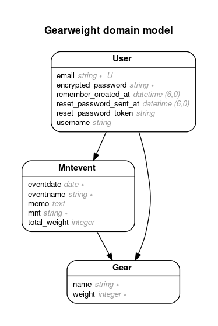

# README

登山に使うウェアの重さをログしていくWebApp．Ruby on rails勉強のためのMVP．

## 特長
- ユーザ認証機能
- ユーザごとに山行記録，ギアを管理
- それぞれの山行記録のギアの総重量の変化を棒グラフで可視化
- テスト実装済み（一部途中）
- Capybaraを使った機能テスト（一部途中）

## この先やることメモ
- gearsテーブルのwearの重複禁止対応
- アプリケーションのコンテナ化
- AWSへのデプロイ
- 外部API連携（地図API）

## 実装メモ
### ER図



### コントローラー
#### mntevent
山行記録の表示，管理

- index
  - ユーザごとの山行記録の一覧の表示．ギアの重さの推移の表示
- show
  - 山行記録の詳細表示．
- new
  - 新しい山行記録の作成．
- create
  - 新しい山行記録の登録．
- edit
  - 山行記録の編集
- update
  - 山行記録の更新
- destroy
  - 山行記録の削除
- mntevent_params
  - パラメタのバリデーション

#### gear
ギアの管理

- index
  - ユーザごとのギア一覧の表示．
- ~~show~~
- new
  - 新しいギアの作成．
- create
  - 新しいギアの登録．山行記録の総重量に新たに登録するギアの重さを加算．
- edit
  - ギアの編集
- update
  - ギアの更新．山行記録の総重量に編集したギアの重さの分，加算または減算．
- destroy
  - ギアの削除．山行記録の総重量に削除したギアの重さを減算．
- gear_params
  - パラメタのバリデーション
- check_duplicate
  - ユーザごとに登録済みのギアの名前に重複がないかチェックする
- gear_weight
  - ギアの名前でDBを検索し，該当するギアの重さを返す

  
### ビュー

#### mntevent
- index
  - 山行記録一覧を表示．
  - それぞれの山行記録のギア総重量を棒グラフで表示．

#### gear
- new
  - ユーザに紐づくギア一覧の表示．プルダウンから登録済みのギアを選択すると，自動的に重さも入力される．
  - プルダウン選択中は，テキストフィールドは無効．テキストフィールドが入力されているときは，プルダウン無効．
  - テキストフィールドから新規ギアを登録するときは，そのユーザがすでに登録しているものは登録できない．


## テスト
### 事前準備
- chronium

```bash
sudo yum install -y epel-release
sudo yum install -y chromium
```

- gem

```ruby
group :test do
  # Use system testing [https://guides.rubyonrails.org/testing.html#system-testing]
  gem "capybara"
  gem "selenium-webdriver"
  gem "webdrivers"
end
```

- test_helper.rb

```test_helper.rb
# Capybaraを使用するための設定
class ActionDispatch::IntegrationTest
  include Capybara::DSL
  include Capybara::Minitest::Assertions
end

# Minitestの実行中にCapybaraを使用するための設定
class Minitest::Test
  include Capybara::DSL
end
```

- application_system_test_case.rb

```application_system_test_case.rb
class ApplicationSystemTestCase < ActionDispatch::SystemTestCase
  Capybara.register_driver :selenium_headless do |app|
      options = Selenium::WebDriver::Chrome::Options.new
    
      options.add_argument('--headless')
      options.add_argument('--no-sandbox')
      options.add_argument('--disable-gpu')
      options.add_argument('--disable-dev-shm-usage')
      options.add_argument('--window-size=1366,720')
      options.add_argument('--remote-debugging-port=9222')
      options.binary = '/usr/bin/chromium-browser'
    
      Capybara::Selenium::Driver.new(app, browser: :chrome, options: options)
  end

    Capybara.default_driver = :selenium_headless

  driven_by :selenium_headless, using: :chrome, screen_size: [1400, 1400]
end
```

#### 実行

- ユニットテスト（モデルのテスト），結合テスト（コントローラテスト）

```bash
rails test
```

- Headless Chromiumを用いたブラウザ経由の機能テストを実施

```bash
rails test:system
```